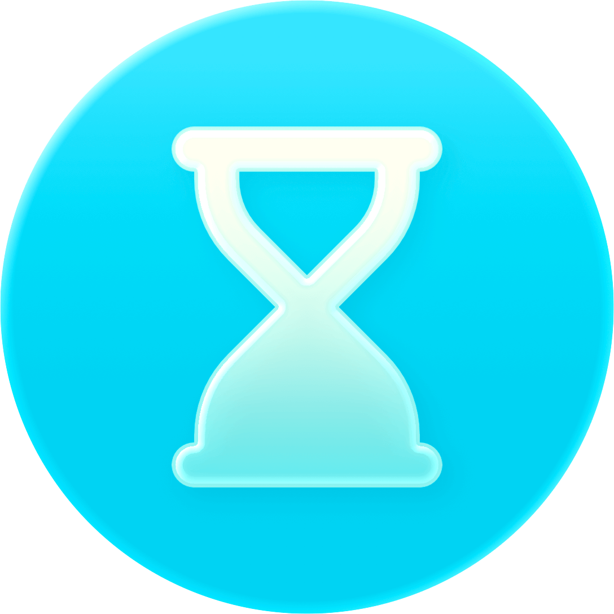
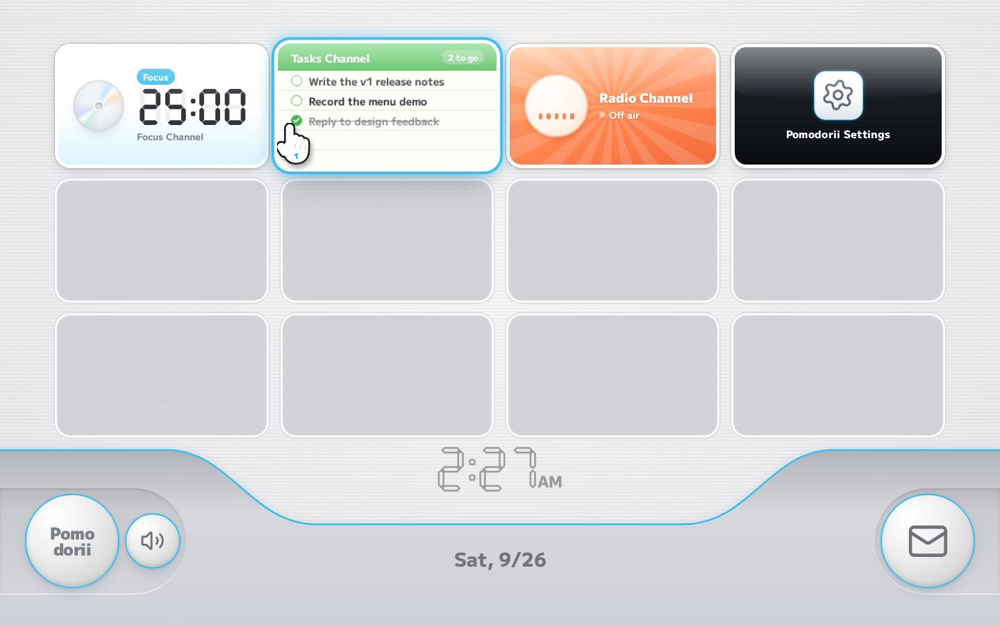
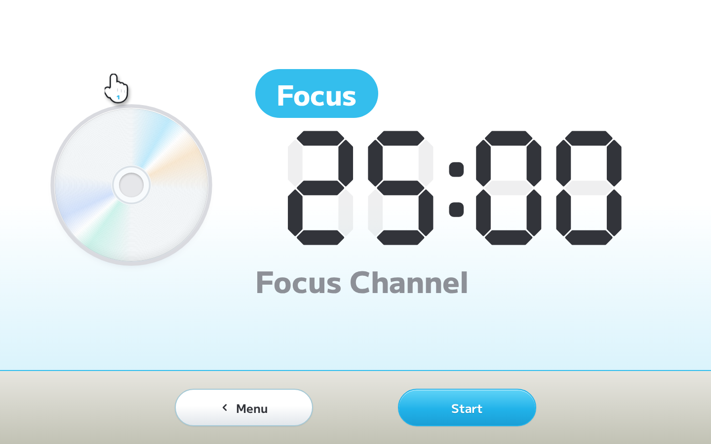
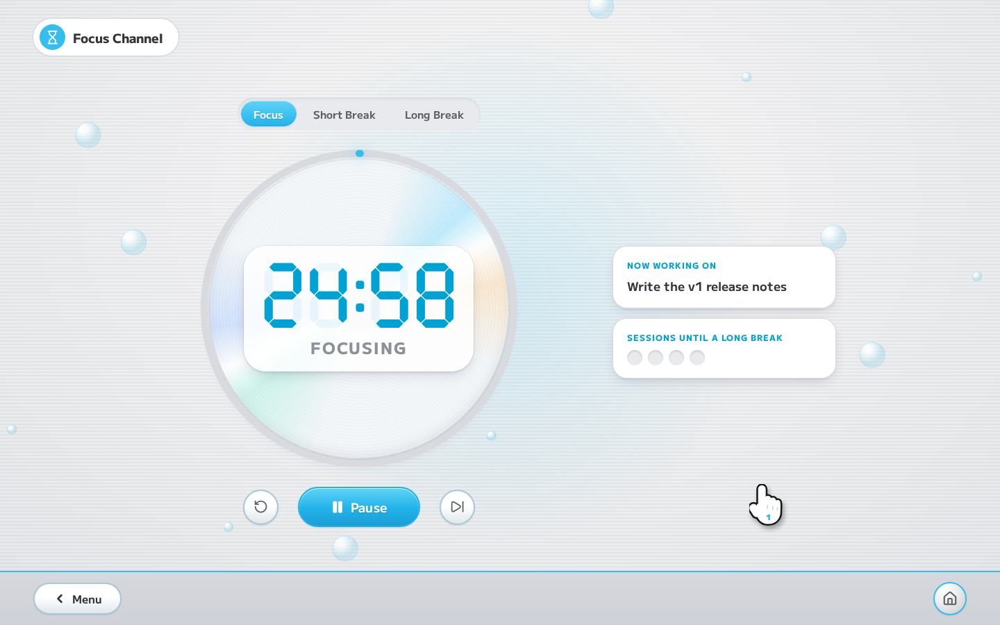
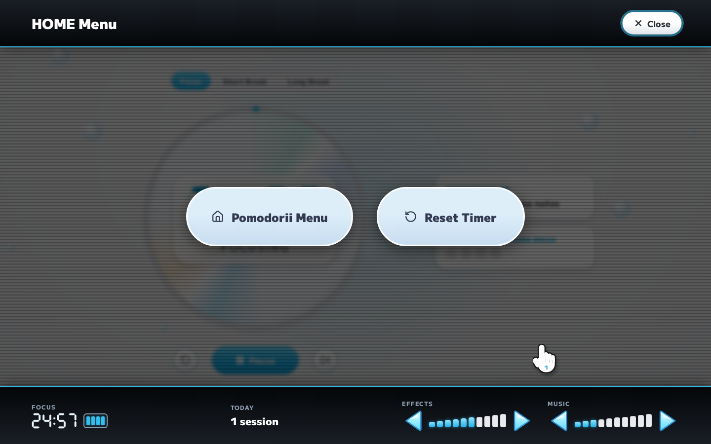
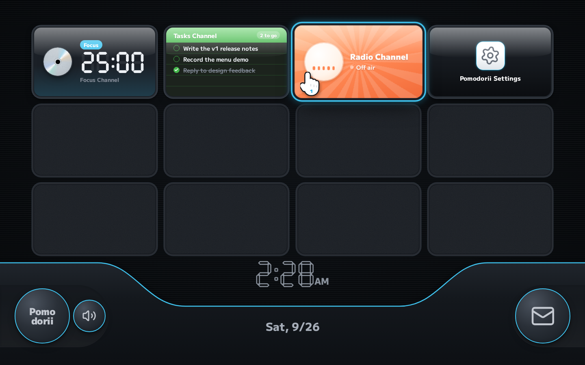

<p align="center">
  
</p>

<h1 align="center">Pomodorii</h1>

<p align="center">
  <strong>A pomodoro timer that plays like a Wii channel.</strong>
</p>

<p align="center">
  <a href="https://www.pomodorii.com">pomodorii.com</a>
</p>

<p align="center">
  
  
  
  
  
</p>



## About

Pomodorii turns a focus timer into a little game console. It boots with a health and safety screen, drops you on a menu of live channel tiles, and zooms into each channel the way the Wii did. Every hover ticks, every press answers back, and the menu has its own music. The whole point is to make sitting down to work feel a bit more like turning on something you love.

Everything runs in the browser. There are no accounts and nothing leaves your machine: tasks, history and settings live in local storage.

## Channels

|                        |                                                                                                                                                                                            |
| ---------------------- | ------------------------------------------------------------------------------------------------------------------------------------------------------------------------------------------ |
| **Focus Channel**      | The timer. A disc spins while you work and a ring fills as the session runs down. Bubbles drift up behind it, the last five seconds tick, and a finished session gets a burst of confetti. |
| **Tasks Channel**      | A to-do list with drag and drop, keyboard reordering and check-off animations. The first open task shows up in the Focus Channel as what you are working on.                               |
| **Radio Channel**      | The built-in Pomodorii theme plus YouTube stations. Streaming mixes keep playing as you move around, showing up live inside the Radio tile on the menu or as a small TV in the corner.     |
| **Pomodorii Settings** | Laid out like Wii System Settings: pages of wide buttons, blue arrow steppers and volume blocks.                                                                                           |
| **Message Board**      | The envelope button. Every finished session is posted as a letter on the day it happened, with a week at a glance.                                                                         |

Press <kbd>H</kbd> anywhere for the HOME Menu, which shows the current session, today's count and the volume controls.

<p>
  
  
  
  
</p>

## Details

- **Sound first.** A small Web Audio engine decodes every effect once and plays it as a buffer source, so hover ticks can overlap and be pitch-shifted without lag. Controls get their sounds through one delegated listener instead of per-button wiring. Music ducks when a session ends so the chime cuts through.
- **A timer that keeps time.** Sessions are stored as a deadline, not a counter, so they stay accurate in background tabs and survive a reload. A session that ran out while the tab was closed still gets logged.
- **The Wii details.** A pointer hand that rolls as you move, fine pinstripes, glossy tiles with an idle bob, static on the empty slots, a scooped bottom bar with a seven-segment clock, and the white flash as a channel starts.
- **Night theme.** Based on the Wii's dark settings screens, and it follows your system by default.
- **Accessible.** Everything works from the keyboard, the arrow keys walk the menu like a D-pad, and Reduce Motion (or the system setting) turns the animation off.
- **Four languages.** English, Japanese, Spanish and Chinese, with plural-aware strings.
- **Installable.** Ships a web app manifest so it can live in a dock or on a home screen.

## Controls

| Key              | Action                                                       |
| ---------------- | ------------------------------------------------------------ |
| <kbd>Space</kbd> | Start or pause the timer                                     |
| <kbd>H</kbd>     | Open or close the HOME Menu                                  |
| <kbd>Esc</kbd>   | Back to the menu                                             |
| <kbd>Enter</kbd> | Start the highlighted channel                                |
| Arrow keys       | Move around the menu grid, or reorder a task from its handle |

## Development

Requires Node 22 or newer.

```bash
npm install
npm run dev
```

| Script            | What it does                     |
| ----------------- | -------------------------------- |
| `npm run dev`     | Start the dev server             |
| `npm run build`   | Build for production             |
| `npm run preview` | Serve the production build       |
| `npm run check`   | Type-check Svelte and TypeScript |
| `npm run lint`    | Prettier and ESLint              |
| `npm test`        | Unit tests with Vitest           |

## Project layout

```
src/
├── routes/                 The single page and its metadata
├── app.css                 Design tokens, themes and shared styles
└── lib/
    ├── audio/engine.ts     Web Audio engine for effects and music
    ├── console/            App state (Svelte runes), transitions and UI sounds
    ├── components/         The menu, channels, overlays and UI pieces
    ├── i18n/               Translations
    ├── radio/              Stations and the YouTube player
    ├── store/              Settings, tasks, history and storage parsing
    └── timer/              The timer logic
static/audio/               Sound effects and the Pomodorii theme
```

The timer, task and history logic are plain TypeScript with unit tests. The UI reads from one `Pomodorii` state class that is shared through Svelte context and written to local storage.

## Credits

Designed and developed by Charles J. (CJ) Dyas. Type is [M PLUS 1](https://github.com/coz-m/MPLUS_FONTS) under the SIL Open Font License. Streaming stations belong to their artists and play through YouTube's embedded player.

Pomodorii is a fan tribute and is not affiliated with or endorsed by Nintendo. Wii is a trademark of Nintendo.

## License

[MIT](LICENSE)
